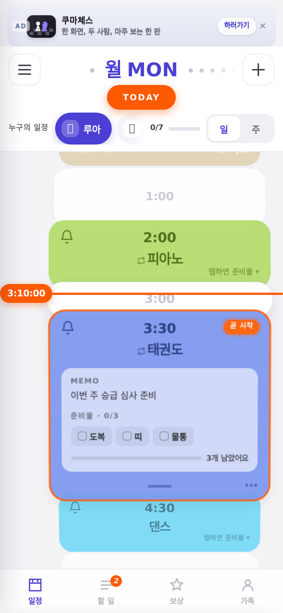
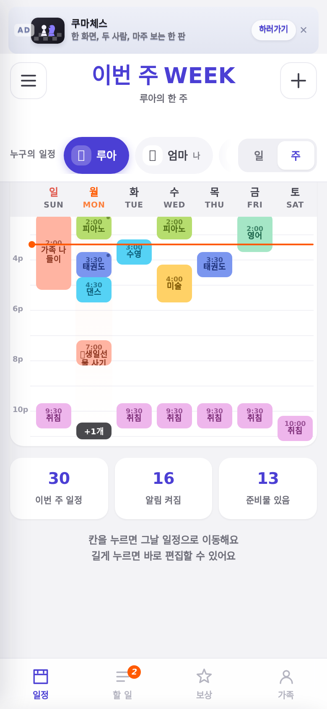
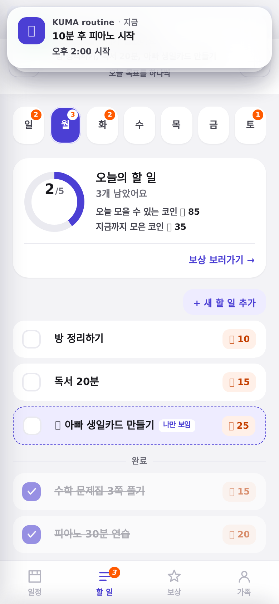
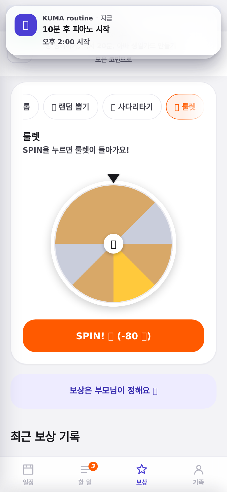
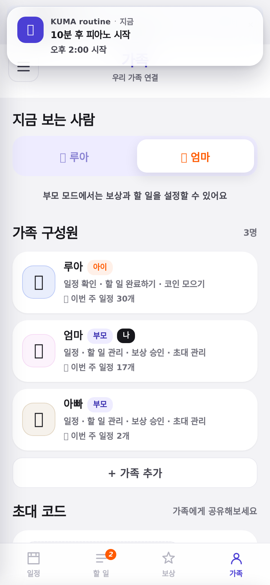
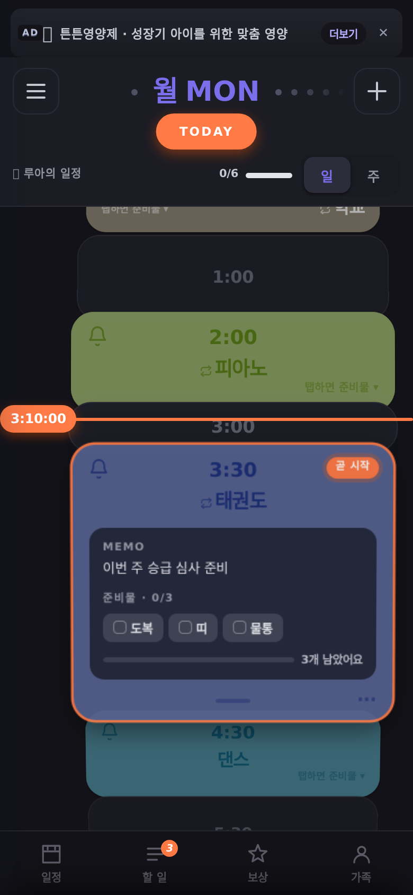

# KUMA routine

초등학생 아이와 학부모가 **하루 일정 · 준비물 · 할 일 · 보상**을 함께 관리하는 모바일 웹앱입니다.

의존성 없는 **단일 HTML 파일**로 동작합니다. 빌드도 서버도 필요 없이 브라우저에서 바로 열면 됩니다.

```
open index.html
```

모바일 폭(390×844)에 맞춰 설계되었습니다. 데스크톱 브라우저에서는 창을 좁히거나 개발자도구의 기기 모드를 쓰면 실제 비율로 볼 수 있습니다.

## 화면

| 일정 (일) | 주간 뷰 | 할 일 |
|---|---|---|
|  |  |  |

| 보상 · 미니게임 | 가족 · 공유 | 다크 모드 |
|---|---|---|
|  |  |  |

---

## 주요 기능

### 일정
- **세로 카드형 타임테이블** — 빈 시간대는 빈 카드로 채워져 하루의 밀도가 그대로 읽힘
- **스크롤 입체 포커스** — 화면 중앙에 가까운 카드가 확대되고 나머지는 뒤로 물러남
- **현재 시간 라인** — 오렌지 라인이 실시간으로 이동
- **가변 UI** — 곧 시작하는 일정은 탭하지 않아도 준비물이 자동으로 펼쳐짐
- **준비물 체크** — 칩을 탭해 챙긴 항목을 표시, 진행 바로 남은 개수 안내
- **일정 완료 체크** — 다녀온 일정에 도장 표시, 하루 진행률 집계
- **드래그로 시간 변경** — 길게 눌러 이동, 하단 핸들로 길이 조절 (5분 단위 스냅)
- **겹치는 일정 나란히 배치** — 같은 시간대 일정을 열로 분리
- **주간 뷰** — 7일을 한 화면에, 밀집한 요일은 `+N개`로 접음
- **매주 반복**, 다른 요일로 복제, 템플릿 빠른 추가

### 할 일 · 보상
- 체크 시 코인 적립, 스와이프로 완료/삭제 (되돌리기 지원)
- 하루 전부 완료 시 축하 연출
- **미니게임 4종** — 럭키 스톱 / 랜덤 뽑기 / 사다리타기 / 룰렛
- 게임 등급(골드·실버·브론즈)에 따라 실물 보상이 달라지는 구조
- **보상 수령 확인** — 아이 요청 → 부모 확인 흐름
- **성취 배지 12종**

### 가족 · 공유
- 부모/아이 **역할 전환** (부모 모드는 PIN 게이트)
- 부모는 아이 일정과 **본인 일정**을 프로필 전환으로 함께 관리
- **비밀 항목** — 작성자에게만 보이고, 검색·알림·주간뷰 어디에서도 노출되지 않음
- **실제로 스캔되는 QR 초대 코드** (외부 라이브러리 없이 직접 구현)
- 주간 요약 공유 카드

### 그 외
- **알림 센터** — 예정 알림 목록, iOS 스타일 인앱 배너(스와이프로 해제), 방해 금지 시간
- **주간 성취 리포트** — 완료율 차트, 코인 추이, 준비물 챙김률, 자동 생성 코멘트
- **다크 모드** — 라이트 / 다크 / 시스템
- **사운드** — Web Audio로 합성한 효과음 8종 (오디오 파일 없음)
- **통합 검색** — 일정·메모·준비물·할 일
- 온보딩, 광고 슬롯과 구독 유도 화면

---

## 구조

```
index.html          빌드 결과물 (이 파일 하나로 동작)
src/
  _core.html        디자인 토큰, 앱 셸, 상태 스토어, 타임테이블
  app_wire.js       일정 편집 시트, 드로어, 부팅
  mod_qr.js         QR 인코더 (Reed-Solomon 포함 직접 구현)
  mod_todo.js       할 일
  mod_reward.js     보상 · 미니게임 4종
  mod_family.js     가족 · 공유 · 프로필
  mod_notify.js     알림 센터 · 인앱 배너
  mod_onboard.js    스플래시 · 온보딩
  mod_theme.js      다크 모드 · 광고 슬롯
  mod_report.js     주간 리포트
  mod_search.js     검색 · 템플릿
  mod_badge.js      성취 배지
  mod_sound.js      효과음 (Web Audio)
  mod_sync.js       가족 그룹 실시간 동기화 (Firebase REST)
  build.js          모듈을 index.html 로 번들
  CONTRACT.md       모듈 작성 규약
  CONTRACT_V2.md    규약 변경분
```

### 빌드

```bash
node src/build.js
```

모듈만 수정하고 위 명령으로 `index.html`을 다시 만듭니다. 런타임 의존성도, 패키지 설치도 없습니다.

---

## 데이터와 프라이버시

- 기본은 **브라우저 `localStorage`에만** 저장됩니다.
- 동기화를 켜면 본인이 만든 Firebase 프로젝트에만 데이터가 올라갑니다.
  개발자가 운영하는 서버는 없습니다.
- 외부 스크립트, 애널리틱스, 추적 쿠키를 **일절 사용하지 않습니다**.
- 처음 실행하면 빈 상태로 시작합니다. 온보딩에서 `예시 일정 넣고 둘러보기` 를
  고르면 둘러보기용 데이터가 들어갑니다.
- 상단 광고는 제휴 링크이며, 별도의 추적 스크립트를 넣지 않았습니다.
- 메뉴의 `데이터 초기화` 로 저장된 내용을 모두 지울 수 있습니다.

---

## 사용 팁

- **☰ → 시간 미리보기** 로 시각을 옮기면 현재 시간 라인이 이동하고, 곧 시작하는 일정이 준비물을 자동으로 펼치며 알림 배너가 실제로 발사됩니다.
- **☰ → 부모 모드로 보기** (처음 PIN `1234`, 건너뛰기 가능) 로 전환하면 프로필 칩이 생겨 아이와 부모의 일정을 오갈 수 있습니다.
- 일정 카드를 **길게 누르면** 드래그로 시간을 옮길 수 있고, 펼친 뒤 `⋯` 로 메뉴를 엽니다.
- 가족 탭의 QR 은 실제로 스캔됩니다. 카메라로 찍어보세요.
- 상단 광고는 `✕ → 체험 시작하기` 로 끌 수 있고, 메뉴에서 다시 켤 수 있습니다.

---

## 가족과 함께 쓰기

### 실시간 동기화 (권장)

초대 코드로 가족 그룹을 만들면 **한쪽에서 일정을 바꿀 때 다른 기기에 바로 반영**됩니다.
Firebase Realtime Database 를 SDK 없이 REST + EventSource 로 붙였습니다.

무료 서버를 한 번 연결하는 준비가 필요합니다 (5분) → **[SYNC-SETUP.md](SYNC-SETUP.md)**

```
메뉴 → 가족 그룹 · 동기화 → 새 가족 그룹 만들기 → 코드 공유
상대방 : 같은 화면 → 코드로 참여하기
```

설정하지 않으면 지금까지처럼 기기 안에서만 동작합니다.
서버 연결 실패가 앱 사용을 막지 않습니다.

### 코드로 한 번만 옮기기

기기를 바꾸거나 백업할 때는 `메뉴 → 코드로 내보내기` 에서 상태를 문자열로 복사해
카톡 등으로 전달하고, 받은 쪽이 붙여넣어 가져올 수 있습니다.

## 설치

브라우저에서 열고 `홈 화면에 추가`를 누르면 PWA 로 설치됩니다.
서비스워커가 아이콘 등 정적 자산을 캐시하고, 화면은 항상 최신을 불러옵니다.

## 범위

기기 간 동기화는 붙어 있습니다(직접 만든 Firebase 프로젝트 사용).
OS 푸시 알림과 결제는 아직입니다. 알림은 앱이 열려 있는 동안 인앱 배너로 동작합니다.

## 라이선스

MIT — [LICENSE](LICENSE)
